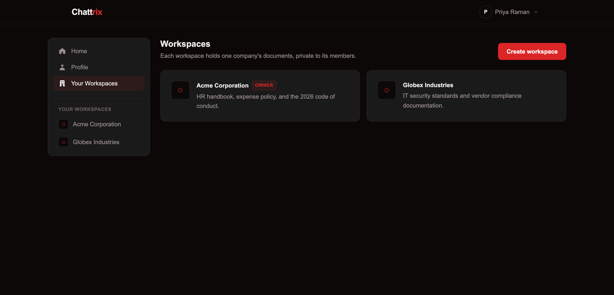
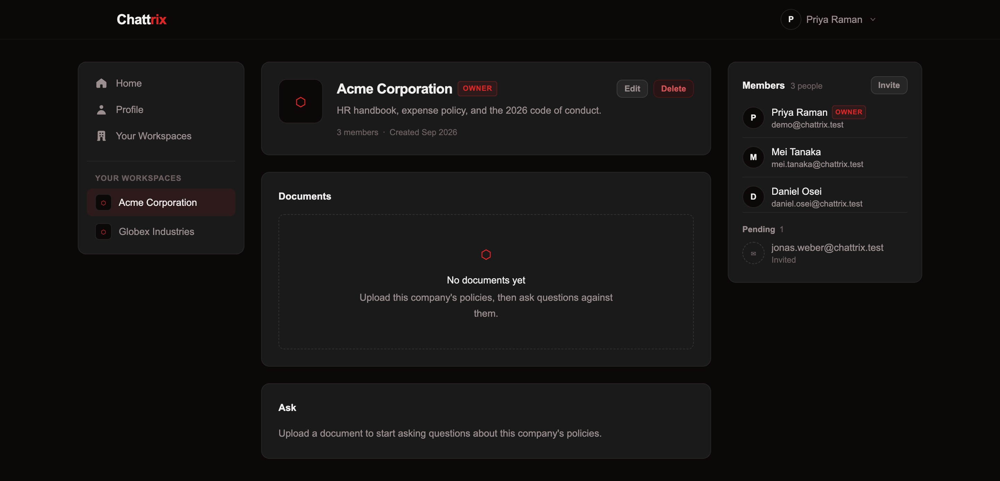
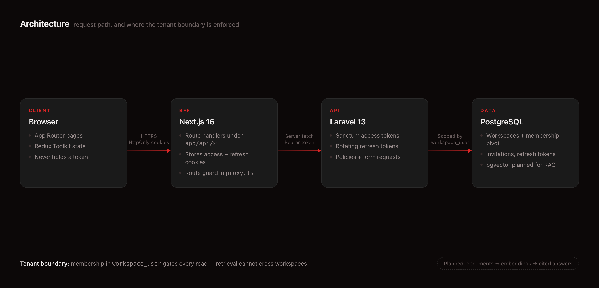

<p align="center">
  
</p>

# Chattrix — AI Workspace Knowledge Base

A full-stack document knowledge platform built with **Next.js, React, TypeScript, Laravel and PostgreSQL**. Teams create a **workspace**, upload their documents to it, and ask questions in plain English that are answered using *only that workspace's* documents, with citations.

Retrieval is tenant-isolated by design: workspace membership gates every read, so one company's documents can never surface in another's answers.

<table>
<tr>
<td width="33%"></td>
<td width="33%"></td>
<td width="33%"></td>
</tr>
<tr>
<td align="center"><sub>Workspaces</sub></td>
<td align="center"><sub>Members &amp; invitations</sub></td>
<td align="center"><sub>Architecture</sub></td>
</tr>
</table>

> **Name:** "Chattrix" = *chat with your knowledge base*. The app was previously a Reddit-style community platform; its auth, workspace, and membership foundations were kept and repurposed for the knowledge-base direction.

## Current Features

**Authentication**
- Register, login, logout, and profile read/update
- Sanctum access tokens paired with **rotating** refresh tokens (SHA-256 hashed, stored server-side)
- Absolute session lifetime carried across rotations, so refreshing cannot extend a session forever
- Email verification with signed links, plus resend
- Rate limiting on every auth route

**BFF layer**
- Next.js route handlers exchange credentials for tokens and store them in **HttpOnly cookies** — browser JavaScript never holds a token
- Route protection in `proxy.ts`, with silent refresh on a missing access token

**Workspaces**
- Create, read, update, delete, authorized by `WorkspacePolicy`
- Owner/member roles in the `workspace_user` pivot — the single source of truth for tenant access
- Member roster, workspace avatars, edit/delete dialogs

**Invitations**
- Email invitations with hashed, expiring tokens
- Public invitation preview, authenticated acceptance flow
- Pending-invitation list for workspace owners

**Demo data**
- `php artisan db:seed --class=DemoSeeder` seeds two workspaces, five users, and a pending invitation. Every demo account uses the password `password`.

### Planned

The RAG layer is not built yet. It is tracked in [`migration.plan.md`](migration.plan.md):

- **M1** — document upload → chunking → Gemini embeddings, stored in PostgreSQL
- **M2** — `RagService` + ask endpoint returning grounded, cited answers
- **M3** — deploy with demo credentials + architecture write-up
- **M4** — pgvector + retrieval evals
- **M5** — extract the AI layer into a Python/FastAPI service

The workspace page already renders the `Documents` and `Ask` panels as empty states; they have no backend behind them yet.

## Table of Contents

- [Architecture](#architecture)
- [Tech Stack](#tech-stack)
- [Repository Layout](#repository-layout)
- [Prerequisites](#prerequisites)
- [Environment](#environment)
- [Installation](#installation)
- [Running Locally](#running-locally)
- [API Overview](#api-overview)
- [Auth Summary](#auth-summary)
- [Security Notes](#security-notes)
- [Documentation](#documentation)

## Architecture

```text
Browser
  |
  | HTTPS, HttpOnly cookies
  v
Next.js frontend / BFF
  - App Router pages and Server Components
  - Route handlers under /app/api/*
  - HttpOnly auth cookies
  - route protection in proxy.ts
  |
  | Server-side fetch with Bearer token
  v
Laravel API
  - Sanctum access tokens
  - custom refresh-token table (rotation)
  - policies and form requests
  - REST endpoints (auth, workspaces, invitations)
  |
  | scoped by workspace_user membership
  v
PostgreSQL (pgvector-ready for RAG)
```

The frontend intentionally acts as a small BFF layer. Browser JavaScript never receives raw access or refresh tokens — the Next.js route handlers talk to Laravel, then store tokens as HttpOnly cookies only the server can read.

The planned RAG layer adds two outbound calls from Laravel — embeddings and generation — via **Google Gemini** (free tier), kept provider-agnostic so a different LLM can be swapped in later. For the detailed auth design, see [docs/AUTH_BFF.md](docs/AUTH_BFF.md).

## Tech Stack

| Area | Stack |
| --- | --- |
| Frontend | Next.js 16.2.2 (App Router, Turbopack), React 19.2, TypeScript 5.9 |
| Styling | Tailwind CSS v4 |
| State | Redux Toolkit, React Redux |
| Backend | Laravel 13, PHP 8.3+ (8.5 in local dev) |
| Auth | Laravel Sanctum access tokens + custom rotating refresh tokens |
| Database | PostgreSQL (pgvector-ready for the RAG stage) |
| AI (planned) | Google Gemini free tier — `gemini-2.0-flash` (generation) + `text-embedding-004` (embeddings) |
| Package management | Yarn 4 workspace for frontend, Composer for backend |

> **Next.js 16 note:** route protection lives in **`proxy.ts`**, not `middleware.ts`. Next.js 16 renamed the file convention; `middleware.ts` is the pre-16 name and is not picked up here.

## Repository Layout

```text
.
+-- Chattrix-Backend/       Laravel API (auth, workspaces, invitations)
+-- chattrix-frontend/      Next.js frontend and BFF route handlers
+-- .github/assets/         README banner, screenshots, architecture diagram
+-- docs/                   Project documentation
+-- plan.html               RAG project plan + learning guide (open in a browser)
+-- migration.plan.md       File-by-file plan for building the RAG feature
+-- DESIGN.md               Product and UI direction
+-- ROADMAP.md              Learning and delivery roadmap
+-- package.json            Root Yarn workspace scripts
+-- yarn.lock
```

## Prerequisites

- PHP 8.3+
- Composer
- Node.js 20+ (Next.js 16 requirement)
- Yarn 4
- PostgreSQL 17 (e.g. `brew install postgresql@17 && brew services start postgresql@17`, then `createdb chattrix`)
- Laravel Herd is supported by the current local examples, but not required

## Environment

### Backend

Configure `Chattrix-Backend/.env` with the usual Laravel values:

```env
APP_NAME=Chattrix
APP_ENV=local
APP_KEY=
APP_DEBUG=true
APP_URL=https://chattrix-backend.test
FRONTEND_URL=http://localhost:3000

DB_CONNECTION=pgsql
DB_HOST=127.0.0.1
DB_PORT=5432
DB_DATABASE=chattrix
DB_USERNAME=your_mac_user
DB_PASSWORD=

SANCTUM_ACCESS_TOKEN_EXPIRATION_IN_MINUTES=60
REFRESH_TOKEN_EXPIRATION_IN_MINUTES=1440
ABSOLUTE_SESSION_LIFETIME_IN_MINUTES=43200

# Planned — for the upcoming RAG feature (free key from https://aistudio.google.com)
GEMINI_API_KEY=
GEMINI_CHAT_MODEL=gemini-2.0-flash
GEMINI_EMBED_MODEL=text-embedding-004
```

`FRONTEND_URL` is used to build invitation and email-verification links.

Generate the app key if needed:

```bash
cd Chattrix-Backend
php artisan key:generate
```

### Frontend

Create `chattrix-frontend/.env.local`:

```env
BACKEND_URL=https://chattrix-backend.test
NEXT_PUBLIC_BACKEND_URL=https://chattrix-backend.test

# Set to 0 only in local development when Node fetch does not trust Herd's local CA.
# Never set this in staging or production — it disables TLS verification entirely.
NODE_TLS_REJECT_UNAUTHORIZED=0
```

`BACKEND_URL` must point to the Laravel backend origin. The Next.js BFF route handlers append API paths such as `/api/auth/login`.

## Installation

Install backend dependencies and set up the database:

```bash
cd Chattrix-Backend
composer install
php artisan migrate                        # or: php artisan migrate:fresh
php artisan db:seed --class=DemoSeeder     # optional demo workspaces and users
```

Install frontend dependencies from the repo root:

```bash
yarn install
```

## Running Locally

Start the Laravel backend (or use Herd and point `BACKEND_URL` at the Herd site URL):

```bash
cd Chattrix-Backend
php artisan serve
```

Start the Next.js frontend from the repo root:

```bash
yarn dev
```

The frontend runs on `http://localhost:3000`. With the demo seeder run, sign in as `demo@chattrix.test` / `password`.

## API Overview

### Auth

| Method | Endpoint | Auth | Purpose |
| --- | --- | --- | --- |
| POST | `/api/auth/register` | Public | Create a user |
| POST | `/api/auth/login` | Public | Issue access and refresh tokens |
| POST | `/api/auth/logout` | Public (bearer optional) | Revoke login state |
| GET | `/api/auth/me` | Sanctum | Return current user |
| PUT | `/api/auth/me` | Sanctum | Update current user |
| POST | `/api/auth/refresh` | `SanctumRefresh` | Rotate the refresh token, issue a new access token |
| GET | `/api/auth/email/verify/{id}/{hash}` | Signed URL | Confirm an email address |
| POST | `/api/auth/email/resend` | Sanctum | Resend the verification email |

All auth routes are throttled at 6 requests/minute.

### Users

| Method | Endpoint | Auth | Purpose |
| --- | --- | --- | --- |
| GET | `/api/users/{user}` | Sanctum, verified | Read a user profile |

### Workspaces

| Method | Endpoint | Auth | Purpose |
| --- | --- | --- | --- |
| GET | `/api/workspaces` | Sanctum, verified | Workspaces the caller belongs to |
| POST | `/api/workspaces` | Sanctum, verified | Create a workspace |
| GET | `/api/workspaces/{workspace}` | Sanctum, verified | Read one workspace |
| PUT | `/api/workspaces/{workspace}` | Sanctum, verified | Update owned workspace |
| DELETE | `/api/workspaces/{workspace}` | Sanctum, verified | Delete owned workspace |
| GET | `/api/workspaces/{workspace}/members` | Sanctum, verified | List workspace members |

### Invitations

| Method | Endpoint | Auth | Purpose |
| --- | --- | --- | --- |
| GET | `/api/workspaces/{workspace}/invitations` | Sanctum, verified | List pending invitations (owner only) |
| POST | `/api/workspaces/{workspace}/invitations` | Sanctum, verified | Invite an email address |
| GET | `/api/workspaces/invitations/{token}` | Public | Preview an invitation before signing in |
| POST | `/api/workspaces/invitations/{token}/accept` | Sanctum, verified | Accept and join the workspace |

### Documents & Ask (planned — see `migration.plan.md`)

| Method | Endpoint | Purpose |
| --- | --- | --- |
| POST | `/api/workspaces/{workspace}/documents` | Upload a document (parsed + embedded) |
| GET | `/api/workspaces/{workspace}/documents` | List a workspace's documents |
| POST | `/api/workspaces/{workspace}/ask` | Ask a question, get a grounded, cited answer |

## Auth Summary

Login is handled through `chattrix-frontend/app/api/auth/login/route.ts`. That route posts credentials to Laravel, receives the token payload, stores `access_token` and `refresh_token` as HttpOnly cookies, and returns only user-safe data to the browser.

Laravel stores access tokens through Sanctum's `personal_access_tokens` table. Refresh tokens are random strings hashed with SHA-256 and kept in the custom `refresh_token` table. On refresh the presented token is invalidated and a new pair is issued, with the original login time carried forward so the absolute session lifetime still applies.

## Security Notes

- Tokens stay out of browser-accessible storage — HttpOnly cookies only.
- Only refresh-token hashes are stored in the database.
- Refresh tokens rotate on every use rather than being reused until expiry.
- Auth routes are rate limited (6/min); invitation preview is limited to 10/min.
- Workspace reads are gated on `workspace_user` membership — never leak one workspace's data into another.
- Use Secure and SameSite cookies in production, and remove any debug or token logging before deploying.

## Documentation

- [RAG Project Plan & Learning Guide](plan.html)
- [Migration Plan (Chattrix → RAG)](migration.plan.md)
- [Auth, Refresh Tokens, and Next.js BFF](docs/AUTH_BFF.md)
- [Design Document](DESIGN.md)
- [Roadmap](ROADMAP.md)

## License

Unlicensed — all rights reserved until a `LICENSE` file is added.
